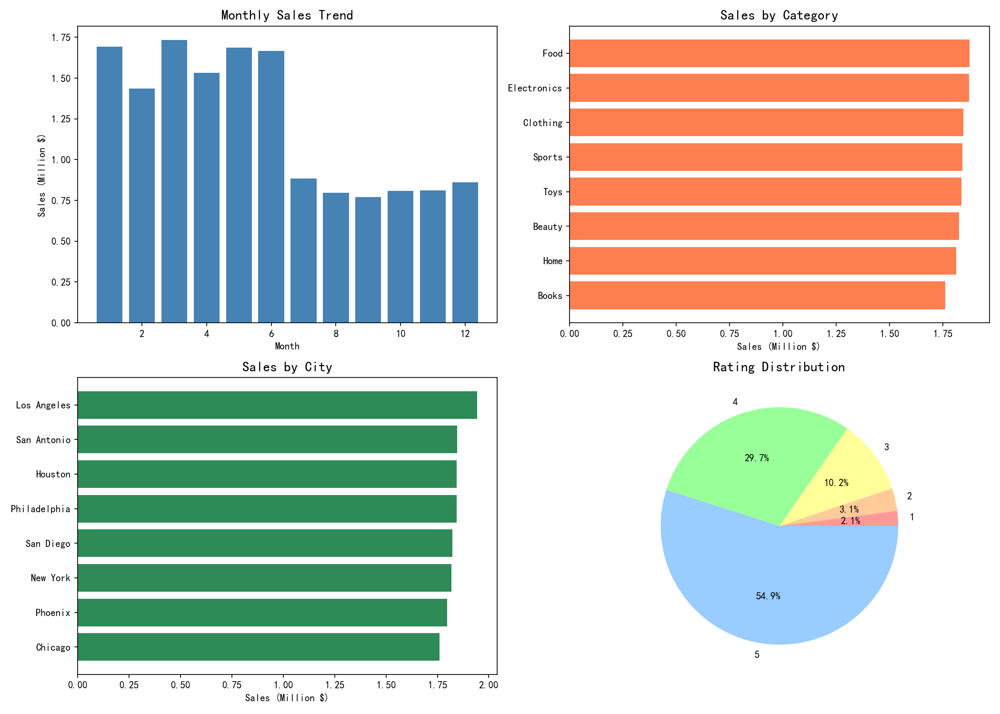

# Amazon Sales Data Analysis

## 项目概述
Amazon电商销售数据分析，对20000条订单数据进行全面分析。

## 数据概况
- 总订单数：20,000
- 总销售额：$14,672,275.30
- 平均客单价：$733.61
- 客户数量：4,913人
- 销售城市：8个
- 时间范围：2023年1月 - 2024年7月

## 分析内容

### 1. 销售趋势分析
- 月度销售趋势
- 季度销售对比
- 订单状态分布

### 2. 产品分析
- 品类销售排名：Food、Electronics、Clothing领先
- 产品销售TOP10：Perfume、Makeup、Shampoo表现最佳

### 3. 客户分析
- 高价值客户识别
- 客户消费分层
- 客户画像

### 4. 地区分析
- 城市销售排名：Los Angeles第一
- 区域销售分析

### 5. 支付与评价
- 支付方式偏好
- 评价分布（54.9%五星好评）
- 配送效率

## 关键发现

1. **销售旺季**：1月、3月、5月销售最佳
2. **主力品类**：Food和Electronics销售额最高
3. **核心城市**：Los Angeles贡献最多销售额
4. **客户价值**：高价值客户（消费>2000$）占19%
5. **服务评价**：五星好评率54.9%，配送平均4天

## 技术栈
- Python
- Pandas
- Matplotlib
- Excel

## 可视化图表

## 业务建议

1. 重点推广Food和Electronics品类
2. 加大Los Angeles等一线城市投放
3. 维护高价值客户，提供专属优惠
4. 提升配送速度，提高好评率
